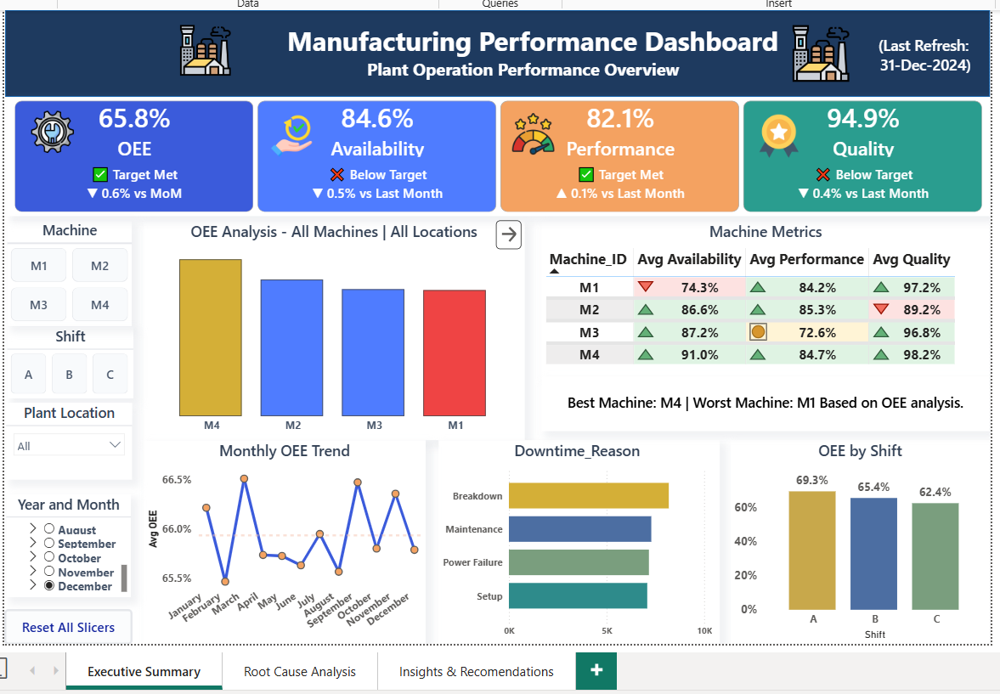
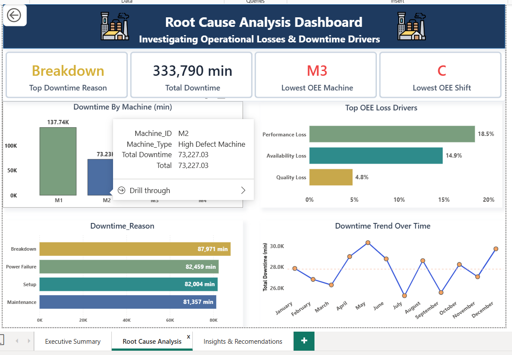

#   Manufacturing KPI  Performance Analysis Dashboard
 
## 📌 Business Problem

Manufacturing plants generate large volumes of production data every day, but without centralized KPI monitoring, it becomes difficult to identify performance losses, understand downtime patterns, and prioritize operational improvements.

This project addresses that challenge by analyzing production data using **Overall Equipment Effectiveness (OEE)** and its key components—**Availability, Performance, and Quality**. The solution enables stakeholders to monitor manufacturing performance, identify root causes of production losses, and support data-driven operational decision-making through interactive Power BI dashboards.

## 💡 Solution Overview

Developed an end-to-end manufacturing analytics solution that transformed raw production data into actionable business insights. The solution leverages **Python** for data preprocessing and KPI calculations, **MySQL** for star schema data modeling, and **Power BI** for interactive dashboard development. It enables production teams to monitor OEE, evaluate machine and shift performance, identify downtime patterns, and support data-driven operational improvements.


## 🏗️ Solution Architecture

```text
Raw Manufacturing Data
        |
        v
Data Cleaning, EDA & OEE Calculation (Python)
        |
        v
MySQL Star Schema
        |
        v
Power BI Dashboard
        |
        v
Business Insights & Recommendations
```

## 🛠️ Technology Stack

| Technology | Purpose |
|------------|---------|
| **Python** | Data cleaning, preprocessing, EDA, KPI calculation |
| **Pandas & NumPy** | Data transformation and analysis |
| **MySQL** | Star schema data modeling and analytical queries |
| **Power BI** | Interactive dashboards, DAX measures, and data visualization |
| **Git & GitHub** | Version control and project documentation |

## 📂 Dataset Overview

| Attribute | Details |
|-----------|---------|
| **Dataset Size** | 5,000 production records |
| **Time Period** | January 2024 – December 2024 |
| **Manufacturing Plants** | Chennai, Mumbai, Pune |
| **Machines** | M1, M2, M3, M4 |
| **Production Shifts** | A, B, C |
| **Key Features** | Planned Production Time, Downtime, Ideal Cycle Time, Total Production, Defective Production, Downtime Reason |

## 🔄 Project Workflow

1. **Data Collection** – Imported manufacturing production data and validated data quality.
2. **Data Preparation** – Cleaned missing values, treated outliers, and created derived production metrics using Python.
3. **KPI Calculation** – Calculated Availability, Performance, Quality, and Overall Equipment Effectiveness (OEE).
4. **Data Modeling** – Designed a Star Schema in MySQL to support efficient analytical reporting.
5. **Dashboard Development** – Built an interactive Power BI dashboard with DAX measures, KPI cards, trend analysis, filters, and drill-through capabilities.
6. **Business Analysis** – Identified production losses, machine inefficiencies, downtime trends, and improvement opportunities.

## 📊 Dashboard Preview

The interactive Power BI dashboard provides a comprehensive view of manufacturing performance through key production KPIs, machine-level analysis, downtime monitoring, and trend visualization. It enables stakeholders to quickly identify operational inefficiencies and support data-driven decision-making.

## 📊 Dashboard Preview

### 📈 Executive Summary

Provides a high-level overview of Overall Equipment Effectiveness (OEE), Availability, Performance, Quality, production trends, and key manufacturing KPIs for december month



---

### 🔍 Root Cause Analysis

Analyzes machine performance, downtime patterns, shift-wise productivity, and operational bottlenecks to identify the primary causes of OEE loss.



---

### 💡 Insights & Recommendations

Presents key business insights and actionable recommendations to improve equipment effectiveness, reduce downtime, and optimize production performance.


### Dashboard

## 📈 Key KPIs

| KPI | Value |
|------|------:|
| **Overall Equipment Effectiveness (OEE)** | **65.9%** |
| **Availability** | **85.1%** |
| **Performance** | **81.5%** |
| **Quality** | **95.2%** |
| **Best Performing Machine** | **M4 (75.7% OEE)** |
| **Lowest Performing Machine** | **M3 (61.0% OEE)** |

## 🔍 Key Insights

- **Machine M4** achieved the highest OEE (**75.7%**), demonstrating consistently strong Availability, Performance, and Quality.
- **Machine M3** recorded the lowest OEE (**61.0%**), primarily due to reduced performance and increased downtime.
- **Availability (85.1%)** remained the strongest OEE component, while **Performance (81.5%)** represented the biggest opportunity for operational improvement.
- Downtime analysis identified production interruptions as a major contributor to reduced equipment effectiveness.
- Machine- and shift-level analysis enabled targeted identification of operational bottlenecks and performance variations.

## 💼 Business Recommendations

- Prioritize maintenance activities for **Machine M3** to reduce downtime and improve production performance.
- Monitor **Performance** as the primary improvement area to increase Overall Equipment Effectiveness (OEE).
- Standardize best operating practices observed on **Machine M4** across other production lines.
- Implement routine KPI monitoring through Power BI dashboards to enable proactive operational decision-making.
- Use machine- and shift-level performance analysis to support production planning and continuous process improvement.

## 📁 Repository Structure

```text
Manufacturing-KPI-Analysis/
│
├── data/
│   ├── raw/
│   │   └── manufacturing_raw.csv
│   └── processed/
│       └── final_manufacturing_data.csv
│
├── notebooks/
│   └── data_cleaning_and_EDA.ipynb
│
├── sql/
│   └── create_star_schema_and_analysis.sql
│
├── dashboard/
│   └── manufacturing_dashboard.pbix
│
├── images/
│   └── dashboard_preview.png
│
└── README.md
```
